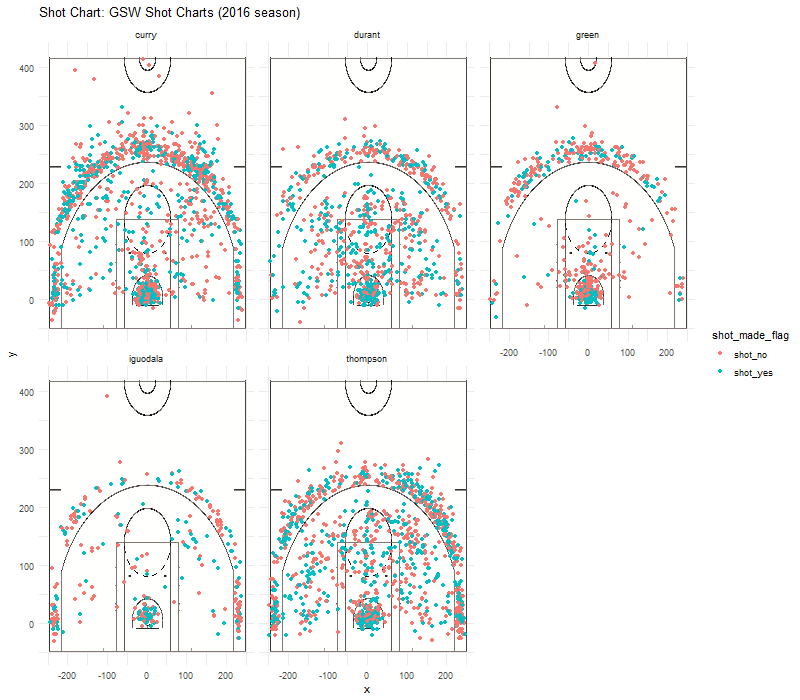

extravaganza

```{r include=FALSE}
library(dplyr)
total <- read.csv("../data/shots-data.csv")

```


# How did the 16 season Warriors play? The secert of NBA Championship!

##### Golden Stat Warriors' shot chart

```{r out.width='80%',echo=FALSE, fig.align='center'}

```


In the NBA's 2016-17 season, there was one team that had won 3 championship in 4 years: the golden state warriors. Perhaps the golden state warriors' only regret that season was that they didn't break the 73-win record which was created by them last season. Two years later, some fans who don't like golden state warriors still saying Warriors' success was due to "spineless" Durant. But the Warriors, who have won more games than any other team in history, are undeniably strong. So how does this team, which we are fortunate enough to witness the miracle of history, play? 

To start with, let's take a look at the golden state warriors' key lineups for that season: Stephen curry, klay Thompson, draymond green, Andrew iguodala, Kevin Durant, Sean livingston, maris Bates, frezetus ezelli, leandro barbosa. They were a major lineup for the warriors in the 2016-17 season. What do you think these ten guys can do? I think the possibilities are endless for these people.

First of all, let's look at the offensive performance of these 10 players. The most enviable thing is that they have Stephen curry, Kevin Durant and Klay Thompson at the same time, whose performance are phenomenonal! As we can see from the fowwlling table, which shows Warriors starters' shotting data.

######  3-point efficiency of Worriors starter

----
```{r echo=FALSE, comment=''}
three_pt_effective_player <- total %>% 
  filter(shot_type == "3PT Field Goal") %>%
  select(player,shot_made_flag) %>%
  group_by(player) %>%
  summarise(
    total = length(player),
    made = length(which(shot_made_flag == "shot_yes")),
    perc_made = made / total
    ) %>%
  arrange(desc(perc_made))

as.data.frame(three_pt_effective_player)
```
-----

Curry and Thompson shot more than 1200 times 3-point with field goal percentage more than 40%. At the same time, instead of standing still to shoot, Curry and Thompson always run around baseline and using pick and roll to make shooting space. It is a huge trouble for warriors' rival. Because they have to make the Center out of paint area to guard Curry and Thompson, once warriors use pick and roll. 


Secondly, Warriors got Kevin Durant, a MVP level player. Durant's strength is middle range shooting. As we can see from the table, his total 2-point shooting is the most in the team, and field goal percentage is 60%! It was Durant's shooting saved Worriors from the risk of failure in G4, which knocked down Cleveland Cavaliers enventually.

######  2-point efficiency of Worriors starter

----
```{r echo=FALSE, comment=''}
two_pt_effective_player <- total %>% 
  filter(shot_type == "2PT Field Goal") %>%
  select(player,shot_made_flag) %>%
  group_by(player) %>%
  summarise(
    total = length(player),
    made = length(which(shot_made_flag == "shot_yes")),
    perc_made = made / total
    ) %>%
  arrange(desc(perc_made))

two_pt_effective_player
```
-----

Thirdly, Green played an important role in the team.

The reason why the Warriors can have such a tactic is that they have an offensive axis. While the Spurs' offensive axis was Dior or Duncan, the Warriors' offensive axis is only one person without question, Green. Green is an axis in the Warriors' offense system and is indispensable. He is an 3D player who can alse handle the ball and give asistant to Curry and Thompson when they get space.


######  Shooting efficiency of Worriors starter

----
```{r echo=FALSE, comment=''}
three_pt_effective_player <- total %>% 
  filter(shot_type == "3PT Field Goal") %>%
  select(player,shot_made_flag) %>%
  group_by(player) %>%
  summarise(
    total = length(player),
    made = length(which(shot_made_flag == "shot_yes")),
    perc_made = made / total
    ) %>%
  arrange(desc(perc_made))

three_pt_effective_player
```
-----


**To conclusion, Warriors' success is the outcome of combination of super individual skill and excellet teamwork.**


